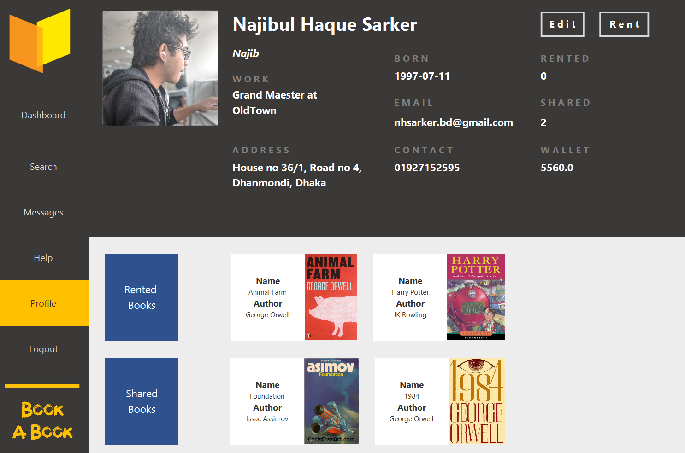

<h1>Bookabook</h1>

Term Project : CSE 108

Project Developers :  
1. Tahmeed Tarek (1705039) 
2. Najibul Haque Sarker (1705044)

 
<h1>Project Walkthrough</h1>

1. Login System 

2. Home Page containing summary of different informations e.g

   - rented books and remaining time
   - shared books and remaining time (can also request for the book which sends an email to the rentee)
   - current wallet
   - trending books
   - latest available books 

3. A search Page to search all available books 

4. By clicking on a book one will be directed to a page containing various information e.g

   - the renting price (per week) and the deposit price
   - the genre.
   - a list of similar books which are links to their respective pages
   - review of the book by the owner
   - reviews of the book by people who have rented the book
   - write a review of the book
   - additional info like print quality, times rented etc 
   

To rent the book one will have to write the number of weeks one will rent and click the "Rent" button. One can also message the owner of the book by clicking the "Message" button.
  

5. A Rent Out Book Page which will need all necessary information 

 

6. A Group Message Page with facilities like

   - showing currently online users
   - showing past messages 
   
 

7. A Profile Page 

 

8. An Edit Profile Page 

 

9. A Help Page 

 

10. Here payment for the book is automatically calculated and taken from the online wallet of the user.
 A deposit is also cut from the user until the rented book is returned within the stipulated time period. 

11. The owner of the book can also "request" for his book. 
 This will send an automatic email to the user reminding him of the deadline.
 

<h1>Future plan</h1>
1. Integrating online payment services 
2. Webscraping for book information
  

### CSE FEST 2019 - Project Showcasing
 
